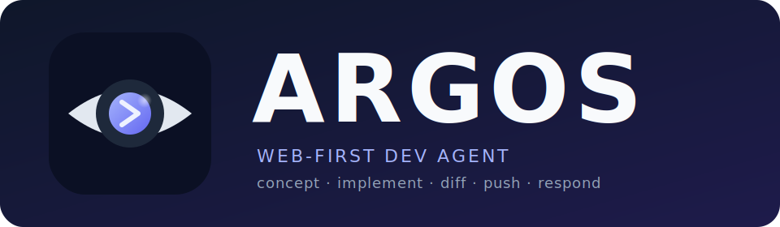

<div align="center">



**A web-first dev agent that turns a task description into a pull request.**

[](LICENSE)
[](https://github.com/nodus-it/argos/releases)
[](https://github.com/nodus-it/argos/pkgs/container/argos-manager)
[](https://github.com/nodus-it/argos/actions/workflows/ci.yml)
[](https://codecov.io/gh/nodus-it/argos)

</div>

---

Argos accepts a task, runs it through isolated worker containers in phases, and opens a pull request you can review.

> [!IMPORTANT]
> - **Runs on your Claude subscription, not the API.** Argos uses the Claude Code OAuth token from `claude setup-token` — your existing Pro / Max / Team plan covers it. No per-token API billing.
> - **Currently optimised for PHP / Laravel projects.** The implement phase wires up Composer, npm, Pint, and Pest/PHPUnit as quality gates. Other stacks work, but the gates and prompts are tuned for Laravel today.

**Phases:** `concept` → `implement` → `diff` → `push` (PR) → `respond` (review feedback)

Two images, one user-facing container: the **manager** spawns **worker** containers via the Docker socket. The AI runs only inside the worker — no AI process ever touches the socket.

| Image | Purpose |
| --- | --- |
| `ghcr.io/nodus-it/argos-manager` | Web UI, queue, MariaDB, Docker socket → spawns workers |
| `ghcr.io/nodus-it/argos-worker`  | Claude Code, Git, PHP/Node — fully isolated, no socket |

## Quick start (one-liner)

```bash
docker run -d --name argos -p 8080:80 \
  -v /var/run/docker.sock:/var/run/docker.sock \
  -v argos-data:/data -v argos-db:/var/lib/mysql \
  ghcr.io/nodus-it/argos-manager:latest
```

Then open <http://localhost:8080/admin>.

> The manager pulls `ghcr.io/nodus-it/argos-worker:php8.4` on first task run. Override with `-e ARGOS_WORKER_IMAGE=...` if you build your own. Change the host port via the `-p` flag.

> [!NOTE]
> **Staging builds.** Every push to the `dev` branch publishes the bleeding edge as `ghcr.io/nodus-it/argos-manager:stage` (worker: `:stage-php8.3` / `:stage-php8.4`). These tags track unreleased work and may break — useful for previewing fixes, but do not pin production deployments to them. When you run the manager from `:stage`, also point it at the matching worker tag, e.g. `-e ARGOS_WORKER_IMAGE=ghcr.io/nodus-it/argos-worker:stage-php8.4`. Stick with `:latest` (or a `vX.Y.Z` tag) for stable use.

## First-time setup

After the container is up, walk through these steps once:

1. **Sign in.** The first visit auto-creates an admin user. Set a password under *Profile* before exposing the instance.
2. **Add your Claude OAuth token.** Under *Settings → Claude*, paste the token from `claude setup-token` (Claude Code CLI, signed in to your Pro / Max / Team plan). You can also pre-seed it via `-e CLAUDE_CODE_OAUTH_TOKEN=...` on the `docker run` line.
3. **Connect a Git host.** Under *Repository Profiles*, add a profile with the repo URL, base branch, and a token (GitHub PAT or GitLab token with `repo`/`api` scope). Tokens are encrypted in the DB and only handed to the worker as env vars at run time — never written to disk.
4. **Verify the worker image.** Trigger any small task; the manager will pull `argos-worker` from GHCR. To pre-pull: `docker exec argos docker pull ghcr.io/nodus-it/argos-worker:php8.4`.
5. **(Optional) Persist data outside the volumes.** Replace `argos-data`/`argos-db` with bind mounts if you want host-side backups.

### Optional environment variables

The manager generates a Laravel `APP_KEY` on first boot and persists it to `/data/app-key`, so nothing is required up front. Override only if you want to:

| Variable | Purpose |
| --- | --- |
| `CLAUDE_CODE_OAUTH_TOKEN` | Pre-seed the Claude OAuth token instead of pasting it into the UI. |
| `ARGOS_WORKER_IMAGE` | Override the worker image (default: `ghcr.io/nodus-it/argos-worker:php8.4`). |
| `APP_KEY` | Pin a specific Laravel encryption key (e.g. for backup restores). |

## Usage

### Web UI

1. *Tasks → New* — pick a repository profile, branch, and write the task description.
2. Run phases via the buttons: **Concept** drafts the plan, **Implement** writes the code, **Diff** shows the unified diff, **Push** opens the PR.
3. After review, paste the reviewer's comments into **Respond** to iterate.

Logs, the generated concept, and the diff are visible on the task detail page.

### CLI

```bash
docker exec -it argos php artisan agent:concept   task-001
docker exec -it argos php artisan agent:implement task-001
docker exec -it argos php artisan agent:diff      task-001
docker exec -it argos php artisan agent:push      task-001
```

## Local development

Prerequisites: Docker & Compose v2, PHP 8.4, Composer, Node 22+.

```bash
composer install
npm install && npm run build
cp .env.example .env
php artisan key:generate
php artisan migrate

# Build the worker image locally
docker compose -f .tools/docker/docker-compose.yml --profile build-only build worker-php84

# Run everything (manager via compose, vite watcher locally)
composer run dev
```

Web UI: <http://localhost:8080/admin>.

## Tests

```bash
./worker/tests/run-tests.sh                # all: shellcheck + bats + integration
./worker/tests/run-tests.sh --bats         # bash unit tests
./worker/tests/run-tests.sh --integration  # phase lifecycle against mock-claude
./worker/tests/run-tests.sh --shellcheck   # lint
php artisan test                           # PHP feature & unit tests
```

## Documentation

[`CLAUDE.md`](CLAUDE.md) holds the conventions for contributors. Architecture lives next to the code: prompts in `worker/prompts/`, schemas in `worker/schemas/`, phase logic in `worker/phases/` and `worker/lib/`.

## License

Released under the [MIT License](LICENSE).
