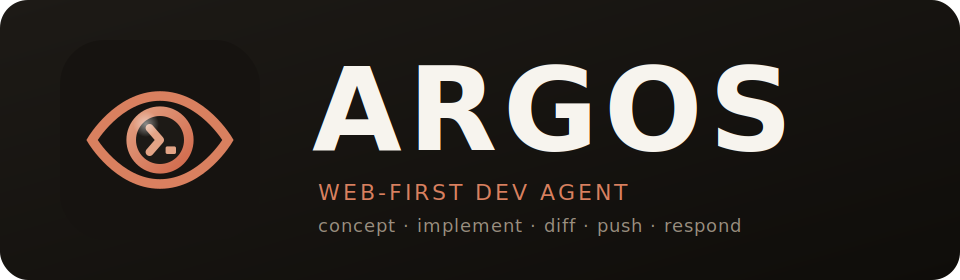
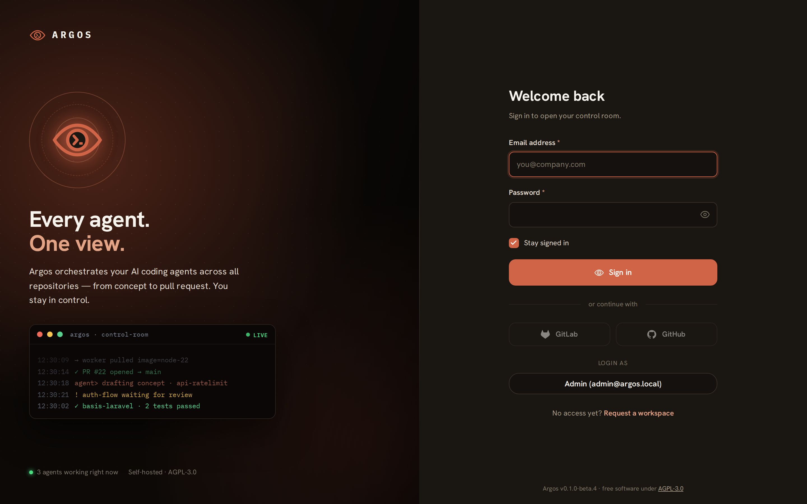

<div align="center">



### Every agent. One view.

**From a task description to a reviewed pull request.** Argos drafts a concept,
implements it in an isolated worker container, and opens the PR — all on your
Claude subscription, not the API.

[](LICENSE)
[](https://github.com/nodus-it/argos/releases)
[](https://github.com/nodus-it/argos/pkgs/container/argos-app)
[](https://github.com/nodus-it/argos/actions/workflows/ci.yml)

<br>



</div>

<!--
  Screenshot gallery — drop PNGs into .github/screenshots/ and uncomment.
  Suggested shots: dashboard (control room), task-view (phase stepper),
  task-logs-running (live agent stream), task-diff (review).

<div align="center">

&nbsp;

</div>
-->

---

Argos accepts a task description, runs it through isolated worker containers
in phases (`concept` → `implement` → `diff` → `push`), and opens a pull
request you can review.

> [!IMPORTANT]
> - **Runs on your Claude subscription, not the API.** Argos uses the Claude
>   Code OAuth token from `claude setup-token` — your existing Pro / Max /
>   Team plan covers it. No per-token API billing.
> - **Currently optimised for PHP / Laravel projects.** The implement phase
>   wires up Composer, npm, Pint, and Pest/PHPUnit as quality gates. Other
>   stacks work, but the gates and prompts are tuned for Laravel today.

## Quick Start

```bash
curl -fsSL https://raw.githubusercontent.com/nodus-it/argos/master/.tools/install.sh | bash
```

That installs Argos into the **current directory** — drops a `docker-compose.yml`,
generates a fresh `.env` with random secrets, brings up the stack, and prints
the admin password.

**Installer flags** (append after `bash -s --` or pass as env vars):

| Flag | Env var | Effect |
|---|---|---|
| `--dir PATH` | `ARGOS_INSTALL_DIR` | Install into `PATH` instead of `$PWD` |
| `--version REF` | `ARGOS_VERSION` | Pin a specific Git tag or branch |
| `--stage` | `ARGOS_STAGE=1` | Use rolling `:stage` images from `develop` |
| `--next` | `ARGOS_NEXT=1` | Use rolling `:next` images from the `next` integration branch |
| `--beta` | `ARGOS_BETA=1` | Use the latest release including pre-releases |
| `--reset` | — | Tear down the stack and wipe all data (destructive) |
| `--force` | — | Skip safety prompts (required for `--reset` in non-interactive shells) |
| `--help` | — | Show all options |

Open <http://localhost:8080/admin> — an in-app onboarding wizard walks you
through pasting your Claude token and creating your first project.

To update later, re-run the same command in the same directory: the
installer pulls newer images, merges any new keys from the upstream
`.env.example` into your `.env` without touching existing values, and
restarts the stack. Customisations belong in `docker-compose.override.yml`
next to the compose file — the installer never touches that.

### What this gets you

- ✓ Tasks → automated pull requests on GitHub, GitLab, or Bitbucket
- ✓ Authentication via Personal Access Token, or full OAuth (repo/branch
  pickers + per-user account binding) — OAuth apps are managed in the UI
- ✓ Self-hosted GitLab (set the instance URL when you add the account / OAuth app)
- ✓ Optimised for PHP / Laravel projects out of the box
- ✓ Runs on your Claude Pro / Max / Team subscription
- ✓ Drive Argos from Claude Code via the built-in [MCP server](docs/SETUP-MCP.md),
  or programmatically via the **REST API v1** (Sanctum bearer tokens, `/api/v1`)
- ✓ Import issues from GitHub / GitLab / Linear via [task providers](docs/SETUP-TASK-PROVIDERS.md)
- ✓ Repo-defined worker images — drop a `.argos/worker.dockerfile` to control
  the build environment (BYOI)
- ✓ Ephemeral per-task live demo — preview the implemented branch in a
  throwaway container before merging

### What this does **not** get you out of the box

- ✗ Repository / branch dropdowns + per-user account binding until you connect
  an OAuth app (Configuration → OAuth Apps)
- ✗ Custom domain / TLS (terminate at your reverse proxy)

For any of those: see **[Extended Setup](docs/SETUP.md)**.

After install, open <http://localhost:8080/admin>: the onboarding wizard takes
you from your Claude token to your first project and task.

## Documentation

The full operator documentation is **built into Argos** — open **Help →
Documentation** in the running app (setup, integrations, configuration, and
operations, with deep links from the relevant screens). The same pages live as
Markdown under [`docs/`](docs/) and are readable here on GitHub.

Start with **[Setup](docs/SETUP.md)**. To make a target repository Argos-ready,
see **[Preparing a Project](docs/PREPARE-PROJECT.md)** (covers the
`.argos/worker.dockerfile` build environment and the `.argos/demo.*` live-demo
contract).

## Contributing

Pull requests welcome. See [docs/CONTRIBUTING.md](docs/CONTRIBUTING.md) for
local setup, the test suite, and code conventions.

## License

Released under the [GNU Affero General Public License v3.0 or later](LICENSE).

For commercial use or alternative licensing terms, contact Nodus IT at
[argos@nodus-it.de](mailto:argos@nodus-it.de).
